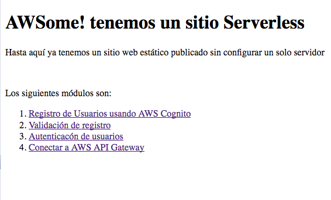

# Módulo 1: Publicando un sitio web estático con la consola de AWS Amplify

Em este módulo configurarás **AWS Amplify** en la consola para hospedar los recursos estaticos de tu aplicación web. En los siguientes módulos agregarás funcionalidades dinámicas a estas páginas usando **Javascript** para realizar llamadas una API RESTful construida con **AWS Lambda** y **Amazon API Gateway**

## Vista general de la arquitectura

La arquitectura para este modulo esta bastante sencilla, todo tu contenido estático incluido el HTML, CSS, Javasript, Imagenes y otros archivos serán administrados por la consola de AWS Amplify y servidos via Amazon Cloudfront. Tus usuarios deberán acceder a tu sitio usando la URL publica entregada por AWS Amplify. No necesitas correr ni configurar ningun servidor ni usar otros servicios para disponibilizar tu sitio


## Instrucciones para la implementación

:heavy_exclamation_mark: Asegúrate de haber seguido la [guía de configuración][setup] antes de comenzar con el Workshop.

Cada una de las siguientes secciones entrega una descripción general de la implementacion e instrucciones paso a paso. La descripción general deberia proveer suficiente contexto para que puedas completar la implementación si es que ya estas familiarizado con la consola de administración de AWS o si es que quieres explorar en los servicios por tu cuenta sin seguir la guía.

### Selección de region

Este workshop puede ser desplegado en cualquier region de AWS que soporte los siguientes servicios:

- AWS Amplify Console
- AWS CodeCommit

Puede encontrar mas informacion en la [tabla de regiones de AWS][region-services] de la documentacion para ver que regiones soportan determinados servicios. Por lo pronto, las regiones que puedes elegir son:
* North America: N. Virginia, Ohio, Oregon
* Europe: Ireland, London, Frankfurt
* Asia Pacific: Tokyo, Seoul, Singapore, Sydney, Mumbai

Una vez hayas elegido la region, deberás desplegar todos los recursos de este workshop en ese lugar. asegúrate de haber seleccionado la región desde la lista desplegable unicada en la esquina superior derecha de la consola web de AWS antes de comenzar.


### Crear una repositorio git
Tienes dos opciones para esta primera etapa, las cuales son usar [AWS CodeCommit][commit] o [GitHub][github] para almacenar el repositorio del sitio. Para el propósito de este curso, nos limitaremos al uso de [AWS CodeCommit][commit], por otro lado, [CodeCommit esta incluido en la capa gratuita de AWS][codecommit-free]

#### Usando CodeCommit
El entorno de desarrollo AWS Cloud9 viene con credenciales temporales administradas por AWS que pueden ser asociadas con tu usuario IAM.
Puedes usar estas credenciales con el manejador de credenciales del AWS CLI. Habilita esta caracteristística ejecutando los siguientes dos comandos en la consola de Cloud9.
```bash
git config --global credential.helper '!aws codecommit credential-helper $@'
git config --global credential.UseHttpPath true
```

Lo siguiente que necesitas hacer, es crear tu repositorio y clonarlo en tu ambiente Cloud9:
1. Abre la [consola de AWS CodeCommit][codecommit-console]
1. selecciona **Create Repository**
1. En el nombre del repositorio *Repository name** escribe "mywebapp-site"
1. Presiona **Create**
1. Desde el menu desplegable *Clone URL*, selecciona *Clone HTTPS*

Ahora en tu entorno de desarrollo Cloud9:
1. Desde la ventana con la terminal ejecuta `git clone` mas la URL HTTPS del repositorio:
    ```
    ec2-user:~/environment $ git clone https://git-codecommit.us-east-1.amazonaws.com/v1/repos/mywebapp-site
    Cloning into 'mywebapp-site'...
    warning: You appear to have cloned an empty repository.
    ec2-user:~/environment $ 
    ```

#### Poblar el repositorio con los archivos del sitio para este workshop
Una vez que tu repositorio ha sido creado y clonado localmente, necesitaras ponerle los archivos para tu sitio web y luego sincronizarlos al repositorio remoto. 

**:white_check_mark: Indicaciones paso a paso**
Desde tu ambiente de desarrollo Cloud9 (o ambiente local)

1. Copia los archivos de este workshop que tenemos disponibles en el zip de este módulo:
    ```
    wget --output-document=website.tar https://raw.githubusercontent.com/hadock/AWS-ServerlessWebApplication-Workshop-Spanish/master/1_StaticWebHosting/website.tar && tar -xvf website.tar && cp -R ./website/ ./mywebapp-site/
    
    Resolving raw.githubusercontent.com (raw.githubusercontent.com)... 151.101.200.133
    Connecting to raw.githubusercontent.com (raw.githubusercontent.com)|151.101.200.133|:443... connected.
    HTTP request sent, awaiting response... 200 OK
    Length: 686080 (670K) [application/octet-stream]
    Saving to: ‘website.tar’
    
    website.tar                     100%[=======================================================>] 670.00K  --.-KB/s    in 0.01s   
    
    2019-09-04 03:18:24 (54.3 MB/s) - ‘website.tar’ saved [686080/686080]
    
    ./website/
    ./website/login.html
    ./website/css/
    ./website/css/application.css
    ./website/verify.html
    ./website/register.html
    ./website/favicon.ico
    ./website/index.html
    ./website/robots.txt
    ./website/js/
    ./website/js/config.js
    ./website/js/cognito-verify.js
    ./website/js/vendor/
    ./website/js/vendor/unicorn-icon
    ./website/js/vendor/jquery-3.1.0.js
    ./website/js/vendor/aws-cognito-sdk.min.js
    ./website/js/vendor/amazon-cognito-identity.min.js
    ./website/js/cognito-session-controller.js
    ./website/js/cognito-login.js
    ./website/js/api-gateway-requests.js
    ./website/js/cognito-register.js
    ./website/operations.html
    ```
1. Commitea los archivos a su servicio git (Probablemente necesites introducir un correo y nombre para el commit):
    ```
    $ git add .
    $ git config --global user.email "<EMAIL ADDRESS>"
    $ git config --global user.name "<USER NAME>"
    $ git commit -m "initial checkin of website code"
    $ git push
    
    Username for 'https://git-codecommit.us-east-1.amazonaws.com': mywebapp-codecommit-at-xxxxxxxxx
    Password for 'https://mywebapp-codecommit-at-xxxxxxxxx@git-codecommit.us-east-1.amazonaws.com': 
    Counting objects: 95, done.
    Compressing objects: 100% (94/94), done.
    Writing objects: 100% (95/95), 9.44 MiB | 14.87 MiB/s, done.
    Total 95 (delta 2), reused 0 (delta 0)
    To https://git-codecommit.us-east-1.amazonaws.com/v1/repos/wildrydes-site
     * [new branch]      master -> master
    ```

### Desplegar un sitio con la consola de AWS Amplify
Lo siguiente que usarás sera la [Consola de AWS Amplify][amplify-console] para desplegar tu sitio que acabas de enviar a tu repositorio git. 
La consola de **Amplify** se hará cargo del trabajo de configurar un lugar para almacenar tu aplicacion web estática y provee un sin número de herramientas para simplificar tanto el ciclo de vida de la aplicación como también habilitar mejores prácticas.

**:white_check_mark: Instrucciones paso a paso**
1. Navega hasta la cosola de [AWS Amplify][amplify-console-console]
1. Haz click en **Connect App**
1. Selecciona el **Repository service provider** que usaremos hoy y luego haz click en **Next**
1. Desde el menú desplegable selecciona el **Repositor** y **Branch** creados y presiona **Next** (*si todo esta por defecto, debería ser la rama `master`*)
    
    
1. En la página "Configure build settings" deja todo por defecto y haz click en **Next**
1. En la página de revisión, haz click en **Save and deploy**
    
    El proceso puede tomar un par de minutos para que la consola de Amplify provisione los recursos necesarios con el fin de desplegar tu código.
    
    

Una vez completado, haz click en el la imagen del sitio para lanzar tu sitio.



Si haces click en el link *Master* veras varias secciones de información respecto al despliegue de tu sitio, incluyendo algunas muestras de previsualización en varias plataformas:


### Ahora modifica el sitio web
La consola de AWS Amplify reconstruirá y redesplegará la applicacion cuando detecte cambios en el repositorio conectado. haz algún cambio en la página principal para probar este proceso.

**:white_check_mark: Instruciones paso a paso**
1. Desde un entorno de desarrollo Cloud9 abre el archivo ```index.html``` ubicado en el directorio raiz de tu repositorio.
1. Modifica la linea del título:
    ```
        <title>MyWebApp!</title>
    ```
    Para que diga **(reemplazando {YOUR NAME} por tu nombre)**:
    ```
        <title>MyWebApp! - {YOUR NAME}</title>
    ```
    Guarda el archivo
1. Haz el commit de los cambios a tu repositorio:
    ```
    $ git add index.html 
    $ git commit -m "updated title"
    [master dfec2e5] updated title
     1 file changed, 1 insertion(+), 1 deletion(-)
    
    $ git push
    Counting objects: 3, done.
    Compressing objects: 100% (3/3), done.
    Writing objects: 100% (3/3), 315 bytes | 315.00 KiB/s, done.
    Total 3 (delta 2), reused 0 (delta 0)
    remote: processing 
    To https://git-codecommit.us-east-1.amazonaws.com/v1/repos/wildrydes-site
       2e9f540..dfec2e5  master -> master
   ```
    La consola de Amplify comenzara a construir el sitio nuevamente tan pronto como detecta los cambios en el repositorio. Lo hará bastante rápido. Muévete rapido a la [pagina de la consola de Amplify][amplify-console-console] para alcanzar a ver el proceso.

1. Una vex que este haya finalizado, vuelve a cargar tu sitio y comprueba el cambio del título en él.

### :star: Recap

:key: La Consola de AWS Amplify nos hace realmente facil desplegar sitios web estaticos siguiendo los modelos de **Integracion y despliegue continuo**. Además tiene la capacidad para realizar procesos mas complicados usando la fase de **build** en el caso de usar frameworks que requieran procesos customizados, renderizando finalmente el resultado usando las plataformas más populares.

:wrench: En este módulo haz creado el sitio web estático que será la base para los siguientes módulos.

### Siguiente

:white_check_mark: Continua con el siguiente módulo, [User Management][user-management], 
donde configurarás **Amazon Cognito User Pools** para administrar los usuarios de tu aplicación.

[setup]: ../0_Setup/
[commit]: https://aws.amazon.com/codecommit
[github]: https://github.com
[iam-console]: https://console.aws.amazon.com/iam/home
[codecommit-free]: https://aws.amazon.com/codecommit/pricing/
[codecommit-console]: https://console.aws.amazon.com/codesuite/codecommit/repositories
[create-repo]: https://help.github.com/en/articles/create-a-repo
[github-new-sshkey]: https://help.github.com/en/articles/generating-a-new-ssh-key-and-adding-it-to-the-ssh-agent
[github-clone]: https://help.github.com/en/articles/cloning-a-repository
[amplify-console]: https://aws.amazon.com/amplify/console/
[amplify-console-console]: https://console.aws.amazon.com/amplify/home
[user-management]: ../2_UserManagement/
[region-services]: https://aws.amazon.com/about-aws/global-infrastructure/regional-product-services/
