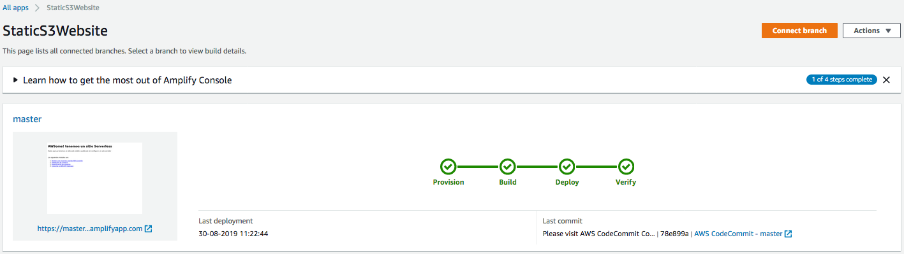
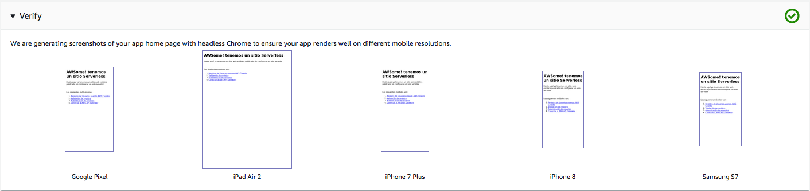

# Módulo 1: Publicando un sitio web estático con la consola de AWS Amplify

Em este módulo configurarás **AWS Amplify** en la consola para hospedar los recursos estaticos de tu aplicación web. En los siguientes módulos agregarás funcionalidades dinámicas a estas páginas usando **Javascript** para realizar llamadas una API RESTful construida con **AWS Lambda** y **Amazon API Gateway**

## Vista general de la arquitectura

La arquitectura para este modulo esta bastante sencilla, todo tu contenido estático incluido el HTML, CSS, Javasript, Imagenes y otros archivos serán administrados por la consola de AWS Amplify y servidos via Amazon Cloudfront. Tus usuarios deberán acceder a tu sitio usando la URL publica entregada por AWS Amplify. No necesitas correr ni configurar ningun servidor ni usar otros servicios para disponibilizar tu sitio


## Instrucciones para la implementación

:heavy_exclamation_mark: Asegúrate de haber seguido la [guía de configuración][setup] antes de comenzar con el Workshop.

Cada una de las siguientes secciones entrega una descripción general de la implementacion e instrucciones paso a paso. La descripción general deberia proveer suficiente contexto para que puedas completar la implementación si es que ya estas familiarizado con la consola de administración de AWS o si es que quieres explorar en los servicios por tu cuenta sin seguir la guía.

### Selección de region

Este workshop puede ser desplegado en cualquier region de AWS que soporte los siguientes servicios:

- AWS Amplify Console
- AWS CodeCommit

Puede encontrar mas informacion en la [tabla de regiones de AWS][region-services] de la documentacion para ver que regiones soportan determinados servicios. Por lo pronto, las regiones que puedes elegir son:
* North America: N. Virginia, Ohio, Oregon
* Europe: Ireland, London, Frankfurt
* Asia Pacific: Tokyo, Seoul, Singapore, Sydney, Mumbai

Una vez hayas elegido la region, deberás desplegar todos los recursos de este workshop en ese lugar. asegúrate de haber seleccionado la región desde la lista desplegable unicada en la esquina superior derecha de la consola web de AWS antes de comenzar.


### Crear una repositorio git
Tienes dos opciones para esta primera etapa, las cuales son usar [AWS CodeCommit][commit] o [GitHub][github] para almacenar el repositorio del sitio. Para el propósito de este curso, nos limitaremos al uso de [AWS CodeCommit][commit], por otro lado, [CodeCommit esta incluido en la capa gratuita de AWS][codecommit-free]

#### Usando CodeCommit
El entorno de desarrollo AWS Cloud9 viene con credenciales temporales administradas por AWS que pueden ser asociadas con tu usuario IAM.
Puedes usar estas credenciales con el manejador de credenciales del AWS CLI. Habilita esta caracteristística ejecutando los siguientes dos comandos en la consola de Cloud9.
```bash
git config --global credential.helper '!aws codecommit credential-helper $@'
git config --global credential.UseHttpPath true
```

Lo siguiente que necesitas hacer, es crear tu repositorio y clonarlo en tu ambiente Cloud9:
1. Abre la [consola de AWS CodeCommit][codecommit-console]
1. selecciona **Create Repository**
1. En el nombre del repositorio *Repository name** escribe "mywebapp-site"
1. Presiona **Create**
1. Desde el menu desplegable *Clone URL*, selecciona *Clone HTTPS*

Ahora en tu entorno de desarrollo Cloud9:
1. Desde la ventana con la terminal ejecuta `git clone` mas la URL HTTPS del repositorio:
    ```
    ec2-user:~/environment $ git clone https://git-codecommit.us-east-1.amazonaws.com/v1/repos/mywebapp-site
    Cloning into 'mywebapp-site'...
    warning: You appear to have cloned an empty repository.
    ec2-user:~/environment $ 
    ```

#### Poblar el repositorio con los archivos del sitio para este workshop
Una vez que tu repositorio ha sido creado y clonado localmente, necesitaras ponerle los archivos para tu sitio web y luego sincronizarlos al repositorio remoto. 

**:white_check_mark: Indicaciones paso a paso**
Desde tu ambiente de desarrollo Cloud9 (o ambiente local)
1. Entra al directorio de tu repositorio recientemente clonado:
    ```
    cd mywebapp-site/
    ```
1. Copia los archivos de este workshop que tenemos disponibles en un bucket S3:
    ```
    aws s3 cp s3://wildrydes-us-east-1/WebApplication/1_StaticWebHosting/website ./ --recursive
    ```
1. Commitea los archivos a su servicio git (Probablemente necesites introducir un correo y nombre para el commit):
    ```
    $ git add .
    $ git config --global user.email "<EMAIL ADDRESS>"
    $ git config --global user.name "<USER NAME>"
    $ git commit -m "initial checkin of website code"
    $ git push
    
    Username for 'https://git-codecommit.us-east-1.amazonaws.com': mywebapp-codecommit-at-xxxxxxxxx
    Password for 'https://mywebapp-codecommit-at-xxxxxxxxx@git-codecommit.us-east-1.amazonaws.com': 
    Counting objects: 95, done.
    Compressing objects: 100% (94/94), done.
    Writing objects: 100% (95/95), 9.44 MiB | 14.87 MiB/s, done.
    Total 95 (delta 2), reused 0 (delta 0)
    To https://git-codecommit.us-east-1.amazonaws.com/v1/repos/wildrydes-site
     * [new branch]      master -> master
    ```

### Deploy the site with the AWS Amplify Console
Next you'll use the [AWS Amplify Console][amplify-console] to deploy the website you've just commited to git. The Amplify Console takes care of the work of setting up a place to store your static web application code and provides a number of helpful capabilities to simplify both the lifecycle of that application as well as enable best practices.

**:white_check_mark: Step-by-step directions**
1. Launch the [Amplify Console console page][amplify-console-console]
1. Click **Connect App**
1. Select the *Repository service provider* used today and select **Next**
    1. If you used GitHub, you'll need to authorize AWS Amplify to your GitHub account
1. From the dropdown select the *Repository* and *Branch* created today
    
    
1. On the "Configure build settings" page leave all the defaults and select **Next**
1. On the "Review" page select **Save and deploy**
    
    The process takes a couple of minutes for Amplify Console to create the neccesary resources and to deploy your code.
    
    

Once completed, click on the site image to launch your Wild Rydes site.


If you click on the link for *Master* you'll see various pieces of information about your website deployment, including sample rendorings on various platforms:



### Modify the website
The AWS Amplify Console will rebuild and redeploy the app when it detects changes to the connected repository. Make a change to the main page to test out this process.

**:white_check_mark: Step-by-step directions**
1. From your Cloud9 environment open the ```index.html``` file in the root directory of the repository.
1. Modify the title line:
    ```
      <title>Wild Rydes</title>
    ```
    So that it says:
    ```
      <title>Wild Rydes - Rydes of the Future!</title>
    ```
    Save the file
1. Commit again to your git repository the changes:
    ```
    $ git add index.html 
    $ git commit -m "updated title"
    [master dfec2e5] updated title
     1 file changed, 1 insertion(+), 1 deletion(-)
    
    $ git push
    Counting objects: 3, done.
    Compressing objects: 100% (3/3), done.
    Writing objects: 100% (3/3), 315 bytes | 315.00 KiB/s, done.
    Total 3 (delta 2), reused 0 (delta 0)
    remote: processing 
    To https://git-codecommit.us-east-1.amazonaws.com/v1/repos/wildrydes-site
       2e9f540..dfec2e5  master -> master
   ```
    Amplify Console will begin to build the site again soon after it notices the update to the repository. It will happen pretty quickly! Head back to the [Amplify Console console page][amplify-console-console] to watch the process. 

1. Once completed, re-open the Wild Rydes site and notice the title change.
    
    

### :star: Recap

:key: AWS Amplify Console makes it really easy to deploy static websites following a continuous integration and delivery model. It has capabilities for "building" more complicated javascript framework based applications and can show you a preview of your application as it would rendor on popular mobile platforms.

:wrench: In this module, you've created static website which will be the base for our Wild Rydes business.

### Next

:white_check_mark: Proceed to the next module, [User Management][user-management], 
wherein you'll configure Amazon Cognito User Pools to manage the users for our application.

[setup]: ../0_Setup/
[commit]: https://aws.amazon.com/codecommit
[github]: https://github.com
[iam-console]: https://console.aws.amazon.com/iam/home
[codecommit-free]: https://aws.amazon.com/codecommit/pricing/
[codecommit-console]: https://console.aws.amazon.com/codesuite/codecommit/repositories
[create-repo]: https://help.github.com/en/articles/create-a-repo
[github-new-sshkey]: https://help.github.com/en/articles/generating-a-new-ssh-key-and-adding-it-to-the-ssh-agent
[github-clone]: https://help.github.com/en/articles/cloning-a-repository
[amplify-console]: https://aws.amazon.com/amplify/console/
[amplify-console-console]: https://console.aws.amazon.com/amplify/home
[user-management]: ../2_UserManagement/
[region-services]: https://aws.amazon.com/about-aws/global-infrastructure/regional-product-services/
