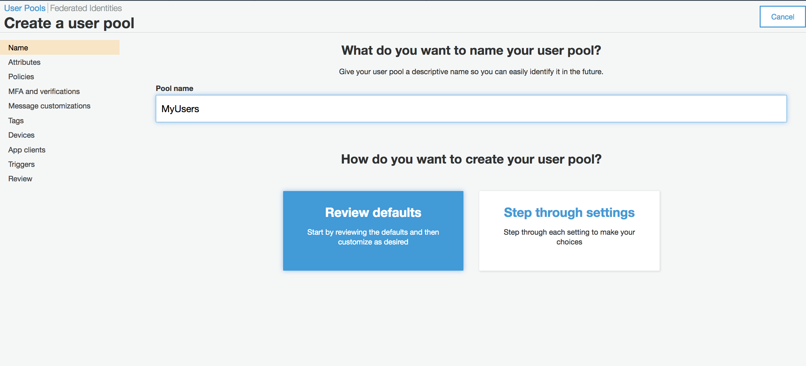
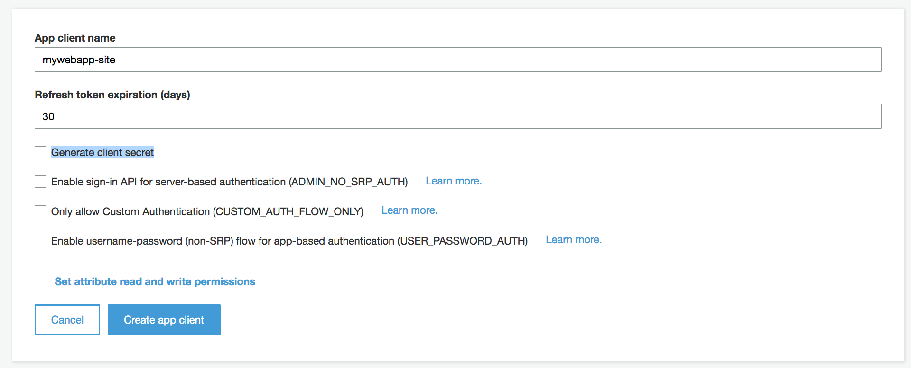
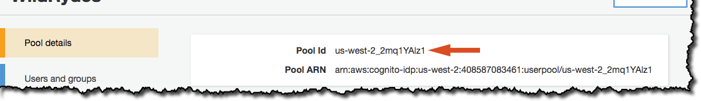
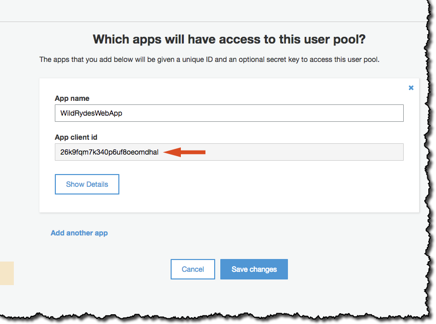

# Módulo 2: Autenticación y registro de usuarios usando Amazon Cognito User Pools

En este módulo crearás un **[Amazon Cognito][cognito] user pool** para administrar las cuentas de usuario. Desplegarás sencillas páginas que permitirán a tus usuarios registrarse, verificar sus correos y loguearse en vuestro sitio.

## Vista general de la arquitectura

Cuando los usuarios visiten tu sitio, ellos primero deberán registrar una cuenta de usuario. Para el proposito de este workshop solo les pediremos que provean un una dirección de correo electrónico válida y una contraseña. Sin embargo, puedes configurar **Amazon Cognito** para solicitar atributos adicionales en tus aplicaciones.

Luego que los usuarios envien sus registros, **Amazon Cognito** enviará un correo de confirmacion con un código de verificación a la direccion de correo electrónico inscrita. Para confirmar esta cuenta, los usuarios tendrán que retornar a tu sitio donde deberán proveer la dirección de correo utilizada para el registro y el código de verificación enviado a esta casilla. Si no quisieras usar una casilla de correo válida, siempre puedes confirmar manualmente la cuenta desde la **consola de Amazon Cognito** para efectos de pruebas.

Después que los usuarios han confirmado el registro de sus cuentas (ya sea con el código o manualmente desde la consola) Ya estarán listos para loguearse en tu sitio. Cuando los usuarios se loguean, ellos deben proporcionar el username o email y el password. Una funcion en **Javascript** se comunica finalmente con **Amazon Cognito** y autentica al cliente usando el protocolo **Secure Remote Password** o **(SRP)** lo que proporciona como respuesta un **JSON Wen Token (JWT)**. Los JWTs contienen información respecto a la identidad del usuario y seran usados en el siguiente módulo para autenticar las peticiones a una API RESTful construida con **Amazon API Gateway**.


## Instrucciones para la Implementación

:heavy_exclamation_mark: Asegúrate de haber completado el módulo [Static Web hosting][static-web-hosting] antes de comenzar con este workshop.

Cada una de las siguientes secciones entrega una descripción general de la implementacion e instrucciones paso a paso. La descripción general deberia proveer suficiente contexto para que puedas completar la implementación si es que ya estas familiarizado con la consola de administración de AWS o si es que quieres explorar en los servicios por tu cuenta sin seguir la guía.

### 1. Crear un Amazon Cognito User Pool

#### Background

Amazon Cognito provee dos mecanismos diferentes para la autenticación de usuarios. Puedes usar **Cognito User Pools** para añadir funcionalidades de registro y autenticación a tus aplicaciones o use **Conito Identity Pools** para autenticar usuarios mediante terceros tales como Facebook, Twitter, Amazon, Soluciones SAML identity or usando tu propio sistema de identidad.
Para este modulo usarás un **user pool** como nackend para proveer registración y autenticacion en tu página.

Use la consola web de **Amazon Cognito** para crear un nuevo **user pool** dejando las configuraciones por defecto. Una vez creado, tome nota del **Pool Id** que usarás en secciones posteriores

**:white_check_mark: Instrucciones paso a paso**

1. Navega hasta la [Consola de Amazon Cognito][cognito-console]
1. Elige **Manage your User Pools**.
1. Haz click en **Create a User Pool**
1. Provee un nombre para tu user pool tal como `MyUsers`, luego selecciona **Review Defaults**
    
1. En la página de revisión, haz click en **Create pool**.
1. Toma nota del **Pool Id** en la página de detalles del recientemente creado **user pool**.

### 2. Agregar un **App Client** a tu **User Pool**

Desde la consola web de **Amazon Cognito** selecciona tu **user pool** y luego dirígete a la sección **App clients**.
Agrega una nueva aplicación asegurandote que la opcion **Generate client secret** NO esté seleccionada. Client secrets no estan soportadas en el SDK de Javascript. 
Si por equivocación creaste una app con la opcion **generated client secret**, eliminala y crea una nueva con la configuración correcta.

**:white_check_mark: Instrucciones paso a paso**
1. Desde la página de detalles de tu **user pool** selecciona el menú **App clients** ubicado en **General settings** al costado izquierdo en la barra de navegación.
1. Selecciona **Add an app client**.
1. Ponle un nombre como por ejemplo `mywebapp-site`.
1. **Desmarca** la opción **Generate client secret**. Client secrets no están soportadas para aplicaciones que corren en navegadores.
1. Haz click en **Create app client**.
   <kbd></kbd>
1. Toma nota del **App client id** de la aplicación creada.

### 3. Actualiza el archivo config.js en tu sitio web

El archivo [/js/config.js][configjs] contiene las configuraciones para el **user pool ID**, **app client ID** y **region**. 
Actualiza este archivo con las configuraciones del **user pool** y **app client** que creaste en los pasos anteriores y luego haz el commit de los cambios a tu repositorio.

**:white_check_mark: Instrucciones paso a paso**
1. En tu entorno de desarrollo Cloud9 abre `js/config.js`
1. Actualiza la seccion de `cognito` con los valores correctos para el **user pool** y **app client** que acabas de crear.
    Puedes encontrar el valor para `userPoolId` en la página de detalles de la consola web de **Amazon Cognito** después de seleccionar el **user pool** que creaste

    
    
    Puedes encontrar el valor para `userPoolClientId` seleccionando **App clients** desde la barra de navegación al costado izquierdo. Utiliza el valor del campo **App client id** de la aplicación que creaste en la sección anterior. 
    
    
    
    El valor para el campo `region` debe ser la región de AWS donde creaste tu **user pool**, por ejemplo `us-east-1` para la región de **N. Virginia** o `us-west-2` para la región de **Oregon**. 
    Si no estas seguro sobre cual debe ser el código de región que debes utilizar, puedes mirar en el valor del ARN en la pagina de detalles del **Pool**. El código de región es parte de ARN y está ubido inmediatamente después de `arn:aws:cognito-idp:`.

    La actualizacion del archivo config.js debería verse como esto. Nótese que los valores para tu archivo pueden variar:
    ```JavaScript
    window._config = {
        cognito: {
            userPoolId: 'us-west-2_uXboG5pAb', // e.g. us-east-2_uXboG5pAb
            userPoolClientId: '25ddkmj4v6hfsfvruhpfi7n4hv', // e.g. 25ddkmj4v6hfsfvruhpfi7n4hv
            region: 'us-west-2' // e.g. us-east-2
        },
        api: {
            invokeUrl: '' // e.g. https://rc7nyt4tql.execute-api.us-west-2.amazonaws.com/prod,
        }
    };
    ```
1. Guarda el archivo modificado asegurándote de mantener el nombre `config.js`.
1. Realiza el commit de los cambios a tu repositorio:
    ```
    $ git add js/config.js 
    $ git commit -m "configure cognito"
    $ git push
    ...
    Counting objects: 4, done.
    Compressing objects: 100% (4/4), done.
    Writing objects: 100% (4/4), 415 bytes | 415.00 KiB/s, done.
    Total 4 (delta 3), reused 0 (delta 0)
    To https://git-codecommit.us-east-1.amazonaws.com/v1/repos/wildrydes-site
       7668ed4..683e884  master -> master
    ```

    La consola de Amplify detectará los cambios y comenzará el despliegue de tu aplicación web.

**Note:** En ves de tener que escribir todo el código que se ejecuta en el navegador para manejar el flujo de la registración, verificacion y autenticación. 
Aquí te proveemos una implementación funcional con los archivos que desplegaste en el primer módulo.
Los archivos [cognito-register.js](../1_StaticWebHosting/website/js/cognito-register.js) para manejar los pasos del registro, [cognito-verify.js](../1_StaticWebHosting/website/js/cognito-verify.js) quien maneja los pasos de verificación,
[cognito-login.js](../1_StaticWebHosting/website/js/cognito-login.js) para manejar la interfaz de autenticación y [cognito-session-controller.js](../1_StaticWebHosting/website/js/cognito-session-controller.js) quien tiene la implementación para verificar la sesión de tus usuarios. 
Todos estos archivos contienen el código que manejan los eventos de la interfaz para llamar a los metodos apropiados del SDK de **Amazon Cognito Identity**.
Para mas información respecto a este SDK, puedes visitar la página del [proyecto en GitHub](https://github.com/aws/amazon-cognito-identity-js).

## Validación de la implementación

**:white_check_mark: Instrucciones paso a paso**
1. Visita la pagina `register.html` que esta contenida en tu sitio web o haz click en **Registro de Usuarios usando AWS Cognito** en el homepage de tu sitio.

1. Completa el formulario de registro y haz click en **Registrar**. Puedes usar tu propio correo o uno falso. Asegurate de elegir una contraseña que contenga al menos una letra mayúscula, un numero y un caracter especial. Intenta no olvidarla ya que la usarás luego. Deberias recibir una alerta en el browser confirmando que se ha creado el usuario.

1. Confirma tu nuevo usuario usando uno de los siguientes métodos.

  1. Si usaste un correo al cual tienes acceso, puedes completar los pasos de verificación de cuenta visitando `/verify.html` en tu sitio web o haz click en **Validación de registros** en la página de inicio he introduciendo el código de verificación que te fue enviado por correo electrónico. Tome nota de que el correo de verificación pudo haber terminado en su carpeta de spam. Para ambientes productivos, recomendamos [configurar su user pool para usar Amazon Simple Email Service (SES)](http://docs.aws.amazon.com/cognito/latest/developerguide/cognito-user-pool-settings-message-customizations.html#cognito-user-pool-settings-ses-authorization-to-send-email) para enviar correos desde un dominio del cual seas propietario.
  1. Si usaste una casilla de correo no válida, debes confirmar el registro del usuario mediante la consola de Cognito.

    1. Desde la consola web de AWS, haz click en **Services** luego selecciona **Cognito** bajo el grupo **Security, Identity & Compliance**.
    1. Elige la opción **Manage your User Pools**
    1. Luego selecciona el user pool `MyUsers` y haz click **Users and groups** en la barra de navegacion al costado izquierdo.
    1. Deberías poder ver un usuario que correspode a la casilla de correo electrónico que utiizaste en la pagina de registro. Selecciona ese usuario para ver la pagina de detalles del usuario.
    1. Haz click en **Confirm user** para finalizar el proceso de registración.

1. Luego de confirmar al nuevo usuario usando ya sea la página `/verify.html` o la consola de Cognito, visita al página `/login.html` de tu sitio o haz click en **Autenticación de usuarios** en tu página de inicio e identificate usando la combinación correo y contraseña que utilizaste en el proceso de registro.

1. Si eres redirigido a `/operations.html`. Deberías ver un mensaje que dice **API Gateway no se ha configurado aun**.

    

### :star: Recap

:key: Amazon Cognito provee dos posibilidades de administrar usuarios, federadción de identidades, y user pools. [Amazon Cognito][cognito] user pools puede administrar casi cualquier aspecto relacionado a la administración de usuarios y sus credenciales, tales como reestablecimiento de contraseñas, MFA y mucho más!

:wrench: En este módulo has usado **user pools** para crear un sistema de administración de usuarios que nos permitirá autenticar y administrar la información de los usuarios. Desde ahí puedes actualizar la información de tu sitio web y utilizar el SDK de AWS para proveer un formulario de autenticación en el sitio. 

### Next

:white_check_mark: Luego de autenticarte satisfactoriamente en el sitio, puedes proceder con el siguiente módulo, [Serverless Backend][serverless-backend].

### Extra

* Intenta copiar y pegar el **auth_token** que recibiste en el [decodificador online de JWT][jwt-decoder] para entender que es lo que este token significa para tu aplicación.

[static-web-hosting]: ../1_StaticWebHosting/
[amplify-console]: https://aws.amazon.com/amplify/console/
[cognito]: https://aws.amazon.com/cognito/
[setup]: ../0_Setup/
[serverless-backend]: ../3_ServerlessBackend/
[cognito-console]: https://console.aws.amazon.com/cognito/home
[configjs]: ../1_StaticWebHosting/website/js/config.js
[jwt-decoder]: https://jwt.io/
