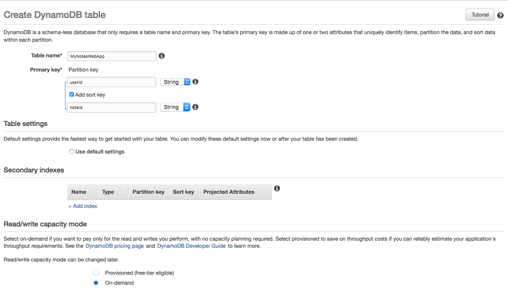
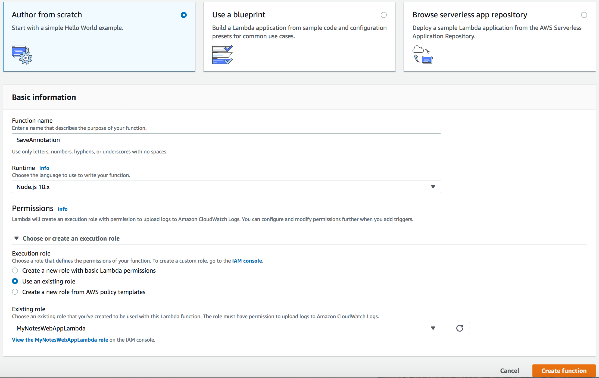
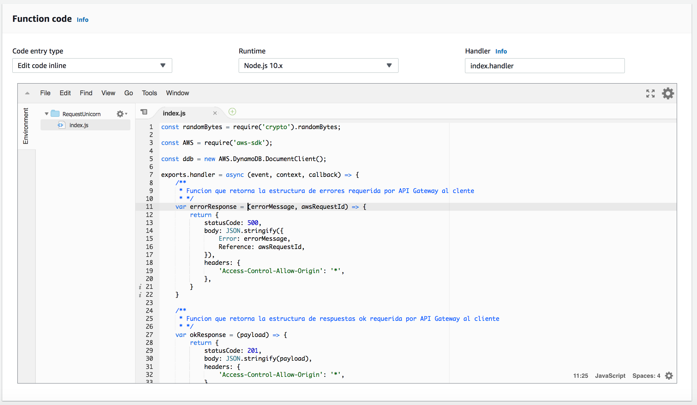
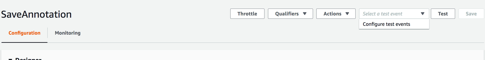
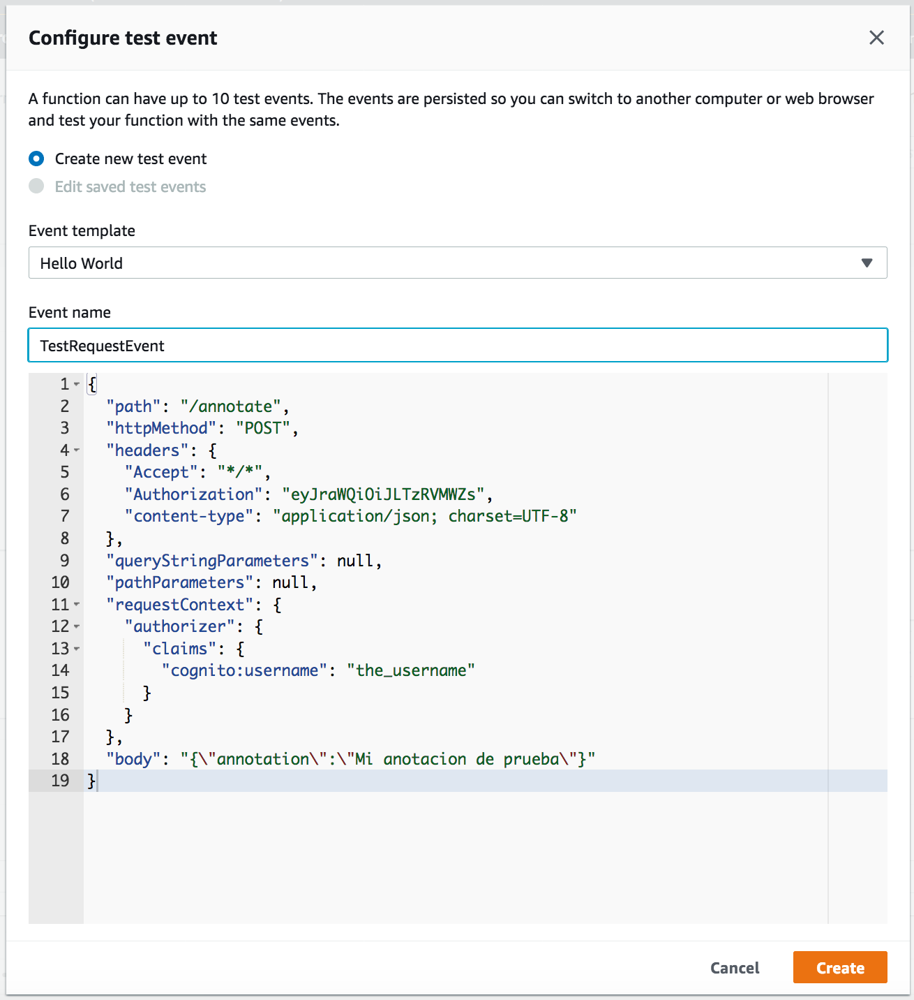

# Módulo 3: Servicio Backend Serverless

En este módulo vas a usar [AWS Lambda][lambda] y [Amazon DynamoDB][dynamodb] para construir el servicio backend que recibirá las peticiones desde tu aplicación web. La aplicación ejecutada en el browser que desplegaste en el primer módulo, permite a los usuarios registrar mensajes y/o notas en una base de datos. De manera de cumplir con ese proposito, el Javascript corriendo en el navegador necesita llamar al servicio corriendo en la nube.  

Implementarás una función lambda que será ejecutada cada vez que un usuario registre una anotación, la función recibirá el texto y lo guardará en la tabla DynamoDB para luego responder a la aplicación cliente en front-end con los detalles de la operación.


La función es invocada desde el navegador usando [Amazon API Gateway][api-gw]. Implementarás esa conexión en el siguiente módulo, para el actual módulo, solo probarás tu función de forma aislada.

## Instrucciones para la implementación

:heavy_exclamation_mark: Asegurate de haber completado los pasos de [User Management][user-management] antes de comenzar con este módulo.

Cada una de las siguientes secciones entrega una descripción general de la implementacion e instrucciones paso a paso. La descripción general deberia proveer suficiente contexto para que puedas completar la implementación si es que ya estas familiarizado con la consola de administración de AWS o si es que quieres explorar en los servicios por tu cuenta sin seguir la guía.

### 1. Crear una tabla Amazon DynamoDB

Use the Amazon DynamoDB console to create a new DynamoDB table. Call your table `Rides` and give it a partition key called `RideId` with type String. The table name and partition key are case sensitive. Make sure you use the exact IDs provided. Use the defaults for all other settings.

After you've created the table, note the ARN for use in the next step.

**:white_check_mark: Step-by-step directions**
1. Go to the [Amazon DynamoDB Console][dynamodb-console]
1. Choose **Create table**.
1. Enter `Rides` for the **Table name**. This field is case sensitive.
1. Enter `RideId` for the **Partition key** and select **String** for the key type. This field is case sensitive.
1. Check the **Use default settings** box and choose **Create**.
    
1. Scroll to the bottom of the Overview section of your new table and note the **ARN**. You will use this in the next section.

### 2. Create an IAM Role for Your Lambda function

#### Background

Every Lambda function has an IAM role associated with it. This role defines what other AWS services the function is allowed to interact with. For the purposes of this workshop, you'll need to create an IAM role that grants your Lambda function permission to write logs to Amazon CloudWatch Logs and access to write items to your DynamoDB table.

#### High-Level Instructions

Use the IAM console to create a new role. Name it `WildRydesLambda` and select AWS Lambda for the role type. You'll need to attach policies that grant your function permissions to write to Amazon CloudWatch Logs and put items to your DynamoDB table.

Attach the managed policy called `AWSLambdaBasicExecutionRole` to this role to grant the necessary CloudWatch Logs permissions. Also, create a custom inline policy for your role that allows the `ddb:PutItem` action for the table you created in the previous section.

**:white_check_mark: Step-by-step directions**
1. Go to the [AWS IAM Console][iam-console]
1. Select **Roles** in the left navigation bar and then choose **Create role**.
1. Select **Lambda** for the role type from the **AWS service** group, then click **Next: Permissions**
    **Note:** Selecting a role type automatically creates a trust policy for your role that allows AWS services to assume this role on your behalf. If you were creating this role using the CLI, AWS CloudFormation or another mechanism, you would specify a trust policy directly.
1. Begin typing `AWSLambdaBasicExecutionRole` in the **Filter** text box and check the box next to that role.
1. Click **Next: Tags**. Add any tags that you wish.
1. Click **Next: Review**.
1. Enter `WildRydesLambda` for the **Role name**.
1. Choose **Create role**. 

Next you need to add permissions to the role so that it can access your DynamoDB table.

**:white_check_mark: Step-by-step directions*
1. While in the IAM Console on the roles page type `WildRydesLambda` into the filter box on the Roles page and choose the role you just created.
1. On the Permissions tab, choose the **Add inline policy** link in the lower right corner to create a new inline policy.
    
1. Select **Choose a service**.
1. Begin typing `DynamoDB` into the search box labeled **Find a service** and select **DynamoDB** when it appears.
    
1. Choose **Select actions**.
1. Begin typing `PutItem` into the search box labeled **Filter actions** and check the box next to **PutItem** when it appears.
1. Select the **Resources** section.
1. With the **Specific** option selected, choose the Add ARN link in the **table** section.
1. Paste the ARN of the table you created in the previous section in the **Specify ARN for table** field, and choose **Add**.
1. Choose **Review Policy**.
1. Enter `DynamoDBWriteAccess` for the policy name and choose **Create policy**.
    

### 3. Create a Lambda Function for Handling Requests

#### Background

AWS Lambda will run your code in response to events such as an HTTP request. In this step you'll build the core function that will process API requests from the web application to dispatch a unicorn. In the next module you'll use Amazon API Gateway to create a RESTful API that will expose an HTTP endpoint that can be invoked from your users' browsers. You'll then connect the Lambda function you create in this step to that API in order to create a fully functional backend for your web application.

#### High-Level Instructions

Use the AWS Lambda console to create a new Lambda function called `RequestUnicorn` that will process the API requests. Use the provided [requestUnicorn.js](requestUnicorn.js) example implementation for your function code. Just copy and paste from that file into the AWS Lambda console's editor.

Make sure to configure your function to use the `WildRydesLambda` IAM role you created in the previous section.

**:white_check_mark: Step-by-step directions**
1. Go to the [AWS Lambda][lambda-console]
1. Click **Create function**.
1. Keep the default **Author from scratch** card selected.
1. Enter `RequestUnicorn` in the **Name** field.
1. Select **Node.js 8.10** for the **Runtime**.
2. Expand *Choose or create an execution role* under **Permissions**.
1. Ensure `Choose an existing role` is selected from the **Role** dropdown.
1. Select `WildRydesLambda` from the **Existing Role** dropdown.
    
1. Click on **Create function**.
1. Scroll down to the **Function code** section and replace the existing code in the **index.js** code editor with the contents of [requestUnicorn.js](requestUnicorn.js).
    
1. Click **"Save"** in the upper right corner of the page.

## Implementation Validation

For this module you will test the function that you built using the AWS Lambda console. In the next module you will add a REST API with API Gateway so you can invoke your function from the browser-based application that you deployed in the first module.

**:white_check_mark: Step-by-step directions**
1. From the main edit screen for your function, select **Configure test events** from the the **Select a test event...** dropdown.
    
1. Keep **Create new test event** selected.
1. Enter `TestRequestEvent` in the **Event name** field
1. Copy and paste the following test event into the editor:
    ```JSON
    {
        "path": "/ride",
        "httpMethod": "POST",
        "headers": {
            "Accept": "*/*",
            "Authorization": "eyJraWQiOiJLTzRVMWZs",
            "content-type": "application/json; charset=UTF-8"
        },
        "queryStringParameters": null,
        "pathParameters": null,
        "requestContext": {
            "authorizer": {
                "claims": {
                    "cognito:username": "the_username"
                }
            }
        },
        "body": "{\"PickupLocation\":{\"Latitude\":47.6174755835663,\"Longitude\":-122.28837066650185}}"
    }
    ```
    
1. Click **Create**.
1. On the main function edit screen click **Test** with `TestRequestEvent` selected in the dropdown.   
1. Scroll to the top of the page and expand the **Details** section of the **Execution result** section.
1. Verify that the execution succeeded and that the function result looks like the following:
    ```JSON
    {
      "statusCode": 201,
      "body": "{\"RideId\":\"1h0zDZ-6KLZaEQCPyqTxeQ\",\"Unicorn\":{\"Name\":\"Shadowfax\",\"Color\":\"White\",\"Gender\":\"Male\"},\"UnicornName\":\"Shadowfax\",\"Eta\":\"30 seconds\",\"Rider\":\"the_username\"}",
      "headers": {
        "Access-Control-Allow-Origin": "*"
      }
    }
    ```

### :star: Recap

:key: [AWS Lambda][lambda] is a serverless functions as a service product that removes the burden of managing servers to run your applications. You configure a trigger and set the role that the function can use and then can interface with almost anything you want from databases, to datastores, to other services eithe publicly on the internet or in your own Amazon Virtual Private Cloud (VPC). [Amazon DynamoDB][dynamodb] is a non-relational serverless database that can scale automatically to handle massive amounts of traffic and data without you need manage any servers.

:wrench: In this module you've created a DynamoDB table and then a Lambda function to write data into it. This function will be put behind an Amazon API Gateway in the next module which will in turn be connected to your web application to capture the ride details from your users.

### Next

:white_check_mark: After you have successfully tested your new function using the Lambda console, you can move on to the next module, [RESTful APIs][restful-apis].

[amplify-console]: https://aws.amazon.com/amplify/console/
[cognito]: https://aws.amazon.com/cognito/
[lambda]: https://aws.amazon.com/lambda/
[api-gw]: https://aws.amazon.com/api-gateway/
[dynamodb]: https://aws.amazon.com/dynamodb/
[static-web-hosting]: ../1_StaticWebHosting/
[user-management]: ../2_UserManagement/
[restful-apis]: ../4_RESTfulAPIs/
[dynamodb-console]: https://console.aws.amazon.com/dynamodb/home
[iam-console]: https://console.aws.amazon.com/iam/home
[lambda-console]: https://console.aws.amazon.com/lambda/home